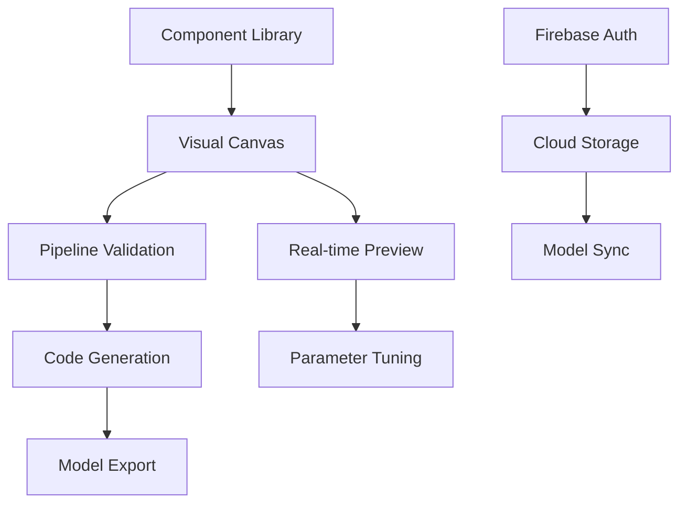

<div align="center">

  
  # DominoML
  
  **Visual Machine Learning Pipeline Builder**
  
  Build powerful ML workflows with drag-and-drop simplicity. No code required.
  
  [](https://opensource.org/licenses/MIT)
  [](https://www.typescriptlang.org/)
  [](https://reactjs.org/)
  [](https://vitejs.dev/)
  [](https://firebase.google.com/)
  
  [**🚀 Try Demo**](https://dominoml.app) • [**📚 Documentation**](#documentation) • [**💬 Community**](#community)
  
</div>

---

## 🎯 **What is DominoML?**

DominoML transforms machine learning development into an intuitive visual experience. Create sophisticated ML pipelines by connecting components like dominoes – each piece triggers the next in a seamless chain of data processing, model training, and evaluation.

**Perfect for:**
-  **Developers** who want to prototype ML models quickly
-  **Data Scientists** who need visual workflow management
-  **Students** learning machine learning concepts
-  **Teams** collaborating on ML projects

---

## ✨ **Key Features**

<table>
<tr>
<td width="50%">

###  **Visual Pipeline Builder**
- Drag-and-drop interface
- Real-time pipeline validation
- Interactive node connections
- Intuitive component library

###  **No-Code Workflow**
- Build complex ML pipelines visually
- Auto-generated Python code
- Template gallery with examples
- One-click model deployment

</td>
<td width="50%">

###  **Cloud Integration**
- Firebase authentication
- Cloud model storage
- Team collaboration
- Cross-device synchronization

###  **Export & Deploy**
- Production-ready Python code
- Jupyter notebook export
- Model versioning
- Easy sharing and collaboration

</td>
</tr>
</table>

---

## 🏗️ **Architecture**



**Built with Modern Technologies:**

- **Frontend:** React 18 + TypeScript + Vite
- **UI Framework:** shadcn/ui + Tailwind CSS
- **Visual Editor:** ReactFlow
- **Backend:** Firebase (Auth + Firestore)
- **Deployment:** Vercel/Netlify Ready

---

##  **Quick Start**

### Prerequisites
- **Node.js** 18+ 
- **pnpm** (recommended) or npm
- **Firebase Account** (optional, for cloud features)

### Installation

```bash
# Clone the repository
git clone https://github.com/1mystic/dominoml.git
cd dominoml

# Install dependencies
pnpm install

# Set up environment variables
cp app/.env.example app/.env
# Edit app/.env with your Firebase config

# Start development server
pnpm dev
```

###  **Access the Application**
Open [http://localhost:5173](http://localhost:5173) in your browser.

---

##  **Documentation**

### 🎓 **Getting Started**
- [Installation Guide](docs/installation.md)
- [First ML Pipeline](docs/getting-started.md)
- [Component Library](docs/components.md)

###  **Configuration**
- [Environment Setup](docs/environment.md)
- [Firebase Configuration](docs/firebase.md)
- [Deployment Guide](docs/deployment.md)

### 🧑 **Development**
- [Contributing Guidelines](CONTRIBUTING.md)
- [API Reference](docs/api.md)
- [Custom Components](docs/custom-components.md)

---

##  **Use Cases**

<details>
<summary><strong>📊 Data Science Workflows</strong></summary>

- **Exploratory Data Analysis:** Visual data pipeline creation
- **Model Comparison:** Side-by-side algorithm testing
- **Feature Engineering:** Drag-and-drop preprocessing
- **Hyperparameter Tuning:** Visual parameter optimization

</details>

<details>
<summary><strong>🎓 Educational Applications</strong></summary>

- **ML Course Labs:** Interactive learning experiences
- **Student Projects:** Visual project development
- **Concept Demonstration:** Pipeline flow visualization
- **Assignment Creation:** Template-based exercises

</details>

<details>
<summary><strong>🏢 Enterprise Solutions</strong></summary>

- **Rapid Prototyping:** Quick POC development
- **Team Collaboration:** Shared model development
- **Model Documentation:** Visual pipeline documentation
- **Knowledge Transfer:** Easy onboarding workflows

</details>

---

##  **Contributing**

We welcome contributions! Please see our [Contributing Guidelines](CONTRIBUTING.md) for details.

###  **Found a Bug?**
[Report it here](https://github.com/yourusername/dominoml/issues/new?template=bug_report.md)

###  **Have a Feature Request?**
[Suggest it here](https://github.com/yourusername/dominoml/issues/new?template=feature_request.md)

###  **Development Setup**

```bash
# Fork the repository
git clone https://github.com/1mystic/dominoml.git
cd dominoml

# Create a feature branch
git checkout -b feature/amazing-feature

# Make your changes and commit
git commit -m 'Add amazing feature'

# Push to your fork and create a Pull Request
git push origin feature/amazing-feature
```

---

##  **Project Stats**

<div align="center">


</div>

---

## 🌟 **Community**

Join our growing community of developers and data scientists:

-  **Discord:** [Join our server](https://discord.gg/dominoml)
-  **Twitter:** [@DominoML](https://twitter.com/dominoml)
-  **Email:** hello@dominoml.app
-  **Blog:** [dominoml.app/blog](https://dominoml.app/blog)

---

##  **License (not yet licensed) **

This project is licensed under the **MIT License** - see the [LICENSE](LICENSE) file for details.

---

<div align="center">

**Built with ❤️ by 1mystic**

[Website](https://dominoml.app) • [Documentation](https://docs.dominoml.app) • [Community](https://discord.gg/dominoml)

⭐ **Star us on GitHub — it motivates us a lot!**

</div>